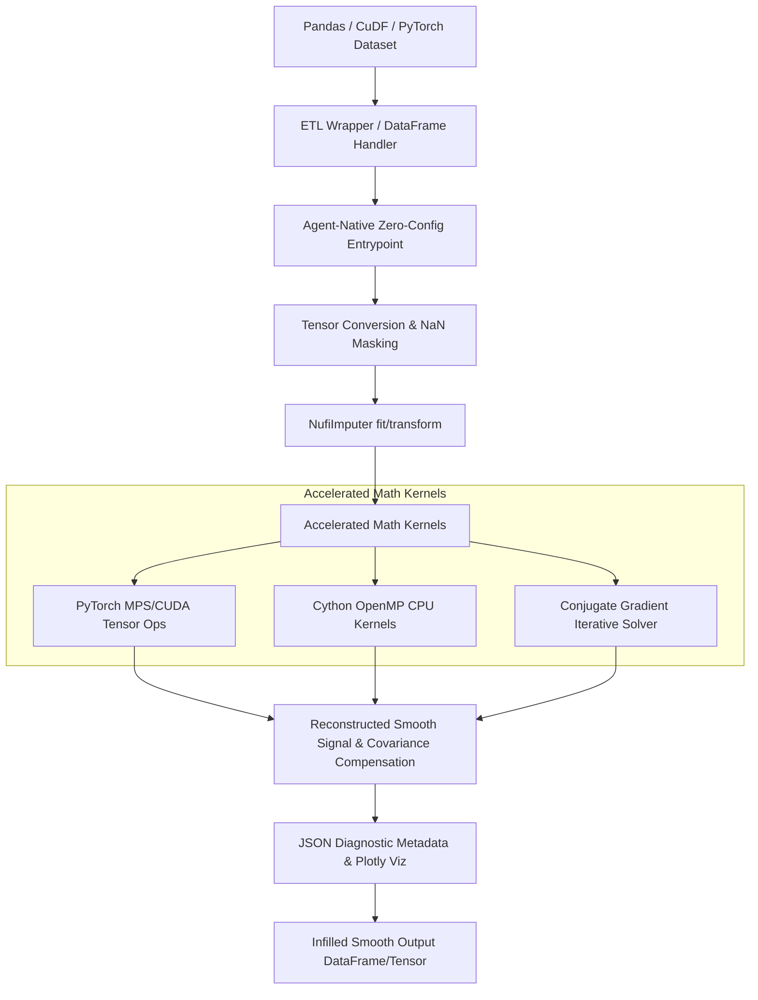

# PLAN.md - Product Requirement Document (PRD)

## 1. Overview and Goal
The objective is to build a high-performance, GPU-accelerated (PyTorch/Apple Silicon/CUDA) Python and Cython library, named `nufi` (Non-Uniform Fourier Infilling), designed for infilling non-uniformly sampled multi-dimensional time-series data. 

Unlike simple linear or polynomial interpolations, which introduce discontinuities in the derivatives, this library uses a Fourier-basis spectral reconstruction technique (based on Non-Uniform Discrete Fourier Transforms, NUDFT). Since trigonometric functions are infinitely differentiable, the reconstructed signal is smooth and preserves all $N$-th derivatives.

Furthermore, `nufi` is designed to be **theoretically rigorous** for PhD data scientists, **highly robust** for enterprise engineers, and **agent-native** for autonomous LLM workflows.

---

## 2. Product Requirements (PRD)

### PR-1: Core Mathematics & Infilling Quality
- **Non-Uniform Spectral Analysis**: Support both 1D and multi-dimensional Non-Uniform Discrete Fourier Transforms (NUDFT) and their fast variants (Interpolated Fast NUDFT).
- **Derivative Preservation**: Reconstruct the underlying signal as a sum of smooth trigonometric basis functions, ensuring that the first, second, and $N$-th derivatives of the infilled signals are continuous.
- **Covariance Preservation**: Implement frequency-domain covariance compensation and LDLᵀ decomposition (as demonstrated in the notebook) to preserve cross-channel and spatial covariance during infilling.
- **NaN Tolerance**: Gracefully ignore or impute NaN values during NUDFT computation without propagating errors.
- **Tikhonov (L2) Regularization**: Support regularized spectral solvers to prevent ill-conditioning and wild oscillations when samples are highly clustered in time.
- **Iterative Conjugate Gradient (CG) Solver**: Implement an $O(N \log N)$ iterative CG solver in PyTorch to scale to massive time-series datasets.
- **Stochastic Multiple Imputation (Bayesian Infilling)**: Support drawing random samples from the posterior distribution of the signal given the residual covariance to represent uncertainty in data mining.
- **Auto-Tuning of Hyperparameters**: Implement Generalized Cross-Validation (GCV) to automatically select optimal frequency bins and regularization penalties.

### PR-2: Agent-Native Architecture (LLM Indispensability)
- **Zero-Config Agent Entrypoints**: Provide a high-level, zero-config `impute_dataframe` function that auto-detects timestamps, columns, and missingness without requiring manual class instantiation.
- **JSON-Serializable Diagnostics**: Return rich metadata including estimated Signal-to-Noise Ratio (SNR), spectral entropy, percentage of variance explained, and numerical stability flags.
- **Diagnostic Visualizations**: Provide a one-liner `plot_diagnostics()` function to generate interactive Plotly/Matplotlib plots comparing raw vs. infilled signals and covariance.

### PR-3: Peer-Reviewed Theory & Rigorous Benchmarking
- **LaTeX Whitepaper**: Formulate a formal publication-ready LaTeX paper in `nufi/paper/main.tex` explaining the mathematical specifications of the NUDFT imputer, derivative properties, and LDLᵀ covariance compensation.
- **Rigorous Empirical Benchmarks**: Run extensive benchmarks comparing `nufi` against standard baselines (Linear/Spline Interpolation, MICE, and Gaussian Processes) across RMSE, covariance discrepancy, and execution speed.

### PR-4: Transformation Logging, Quality Enforcement & Version Tracking
- **Append-Only Transformation Logging**: Maintain a persistent `nufi_transformations.log` file in append-only mode, logging timestamps, shapes, columns, infilled NaN counts, and hyperparameters for every data transformation.
- **Quality Enforcement Exception**: Raise a custom `TransformationLoggingError` exception if any logging or versioning write fails, immediately halting the transaction to prevent silent failures and preserve data lineage.
- **Snapshot-Based Version Control & Reversion**: Provide a `TransformationTracker` system that takes lightweight snapshots of the dataframe before and after transformation (saved in `.nufi_history/`), and enables users/agents to list historical states and revert the dataframe to any previous version.

---

## 3. High-Level Technical Architecture

---

## 4. Extended Implementation Strategy (Phases 1-10)

*Note: Phases 1 to 5 represent the core completed framework.*

- **Phase 1: Project Setup and Boilerplate** (COMPLETED)
- **Phase 2: PyTorch Accelerated GPU Kernels** (COMPLETED)
- **Phase 3: Cython CPU Kernels** (COMPLETED)
- **Phase 4: Scikit-Learn Imputer Core** (COMPLETED)
- **Phase 5: ETL Data Wrappers** (COMPLETED)
- **Phase 6: LaTeX Whitepaper Formulation**: Create `nufi/paper/main.tex` and document the mathematical rigor of the imputer.
- **Phase 7: Advanced Solvers & Imputation**: Implement L2 regularization, CG iterative solver, stochastic multiple imputation, and GCV hyperparameter tuning.
- **Phase 8: Agent-Native Layer**: Write the zero-config entrypoint, JSON diagnostics generator, and interactive diagnostic plotter.
- **Phase 9: Empirical Benchmark Suite**: Write robust benchmark scripts comparing `nufi` with GPs, MICE, and spline interpolation.
- **Phase 10: Validation, Tests & Device Benchmarking** (Updated unit tests for all new modules)
